# Marketing Campaign Analysis Dashboard

## Project Overview

This project analyzes digital marketing campaign performance using Python for data cleaning and Power BI for data visualization.

The goal of the project is to evaluate marketing campaign effectiveness across multiple channels and identify opportunities to improve marketing efficiency 
and return on investment (ROI).

---

## Project Workflow

1. Data Cleaning – Python (Pandas)
2. Data Storage – MySQL
3. Data Analysis – SQL queries
4. Data Visualization – Power BI dashboard
5. Insight Generation – Marketing performance evaluation

---

## Dataset Features

The dataset contains marketing campaign metrics such as:

- impressions
- clicks
- conversions
- revenue
- cost
- CTR
- conversion rate
- CPC
- ROI
- campaign date
- marketing channel

---

## Data Cleaning (Python)

Data preprocessing was performed using Python and the Pandas library.

Key cleaning steps included:

- Removing duplicate values
- Converting numerical columns to proper data types
- Formatting the date column
- Handling missing values
- Verifying calculated marketing metrics

### Python Cleaning Screenshot

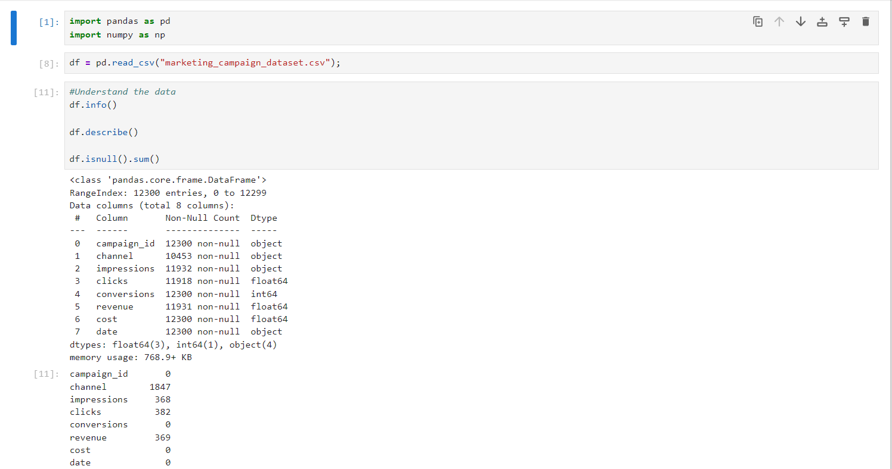
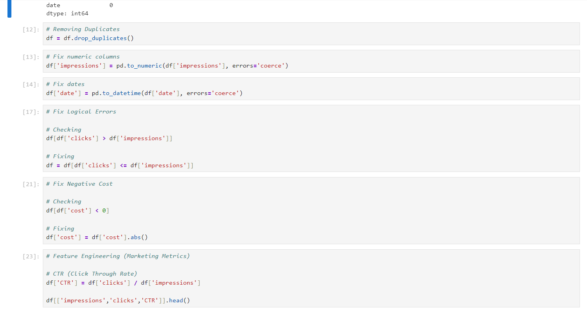
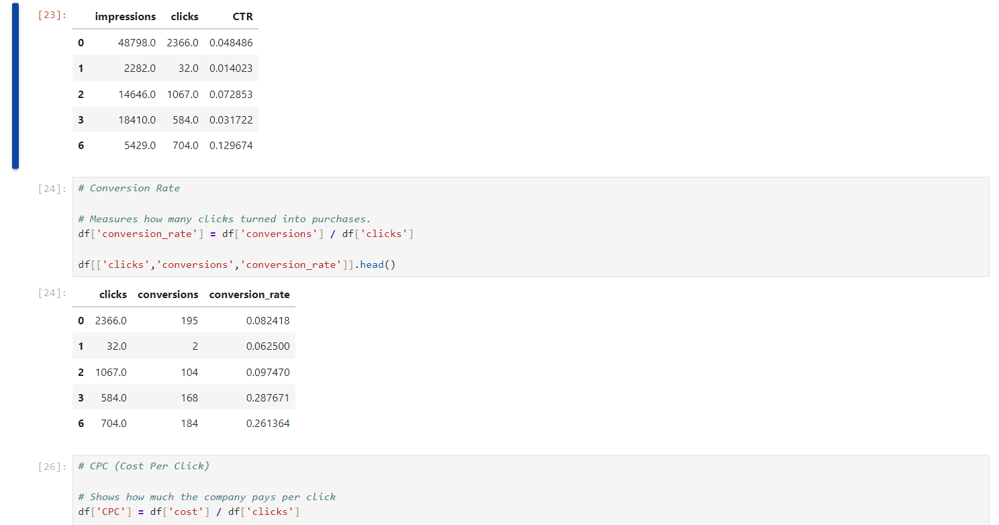
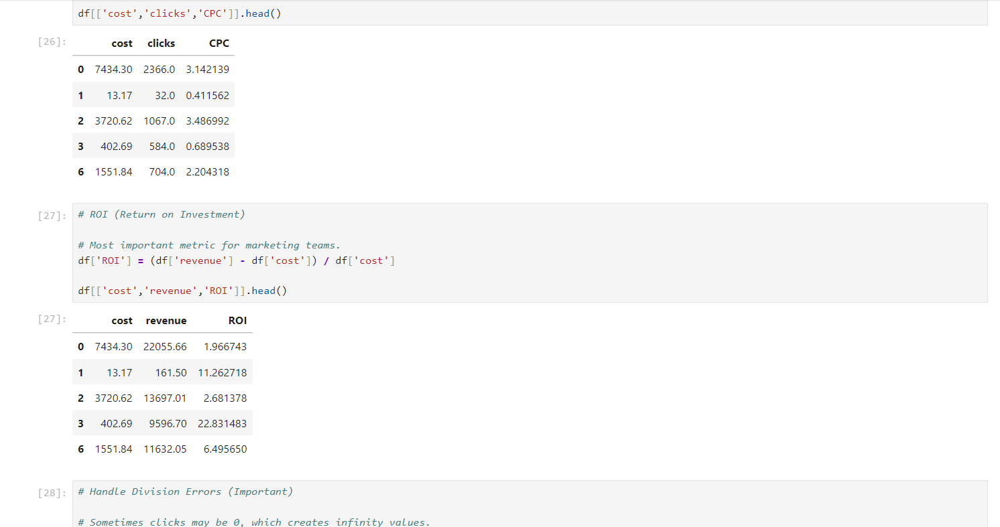
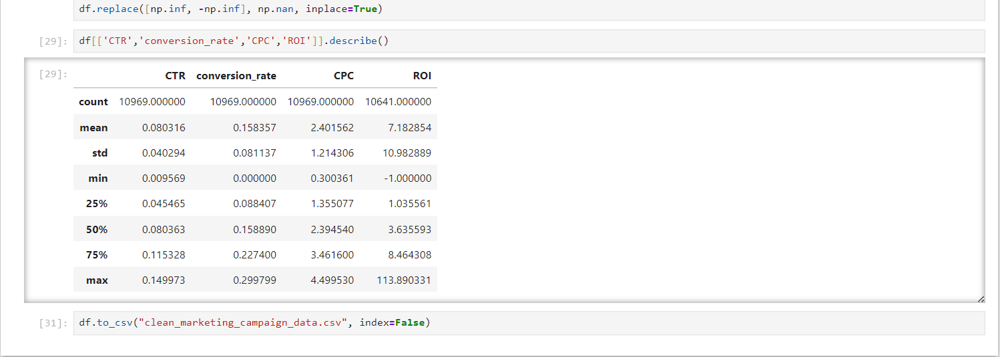

---

## SQL Data Analysis

After loading the cleaned dataset into MySQL, several SQL queries were performed to explore marketing campaign performance and generate insights before building the dashboard in Power BI.

### 1. Total Marketing Performance

This query calculates overall marketing activity and financial performance.

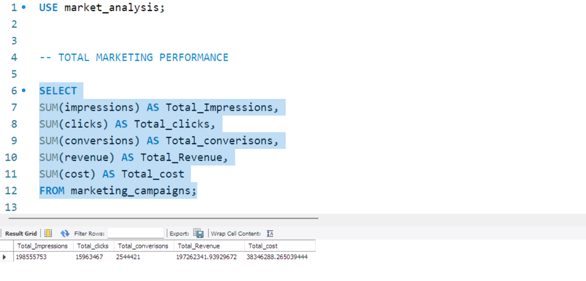

---

### 2. Best Performing Marketing Channel

This query compares marketing channels based on total revenue, cost, and return on investment.

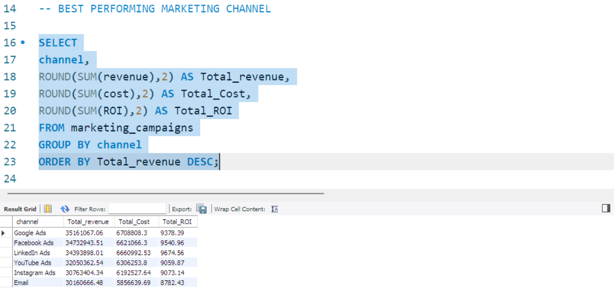

---

### 3. Top 10 Campaigns by ROI

This query identifies the campaigns generating the highest return on investment.

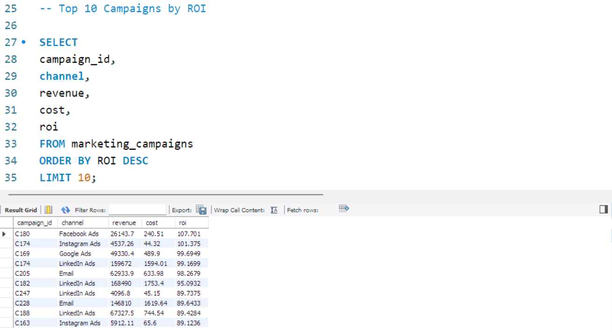

---

### 4. Channel Performance by Conversion Rate

This query evaluates the average conversion rate for each marketing channel.

---

### 5. CTR Performance by Channel

This query analyzes the click-through rate (CTR) for each marketing channel.

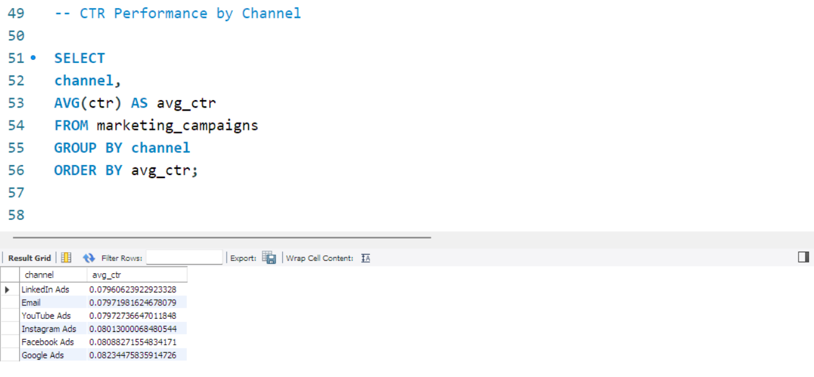

---

### 6. Revenue Trend Over Time

This query calculates daily revenue to analyze marketing performance trends over time.

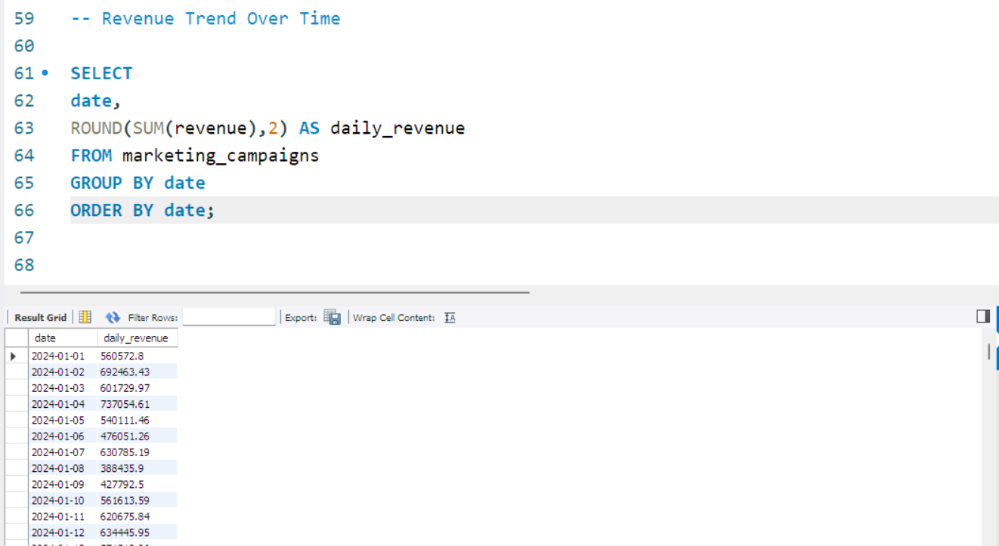

---

These queries were used to explore the dataset and identify key marketing insights before building the interactive Power BI dashboard.

## Power BI Dashboard

An interactive Power BI dashboard was created to visualize marketing campaign performance.

The dashboard includes:

- KPI summary cards
- Revenue by marketing channel
- Conversions by channel
- Conversion rate trend over time
- Campaign efficiency scatter plot
- Top-performing campaigns table
- Interactive filters

---

## Dashboard Preview

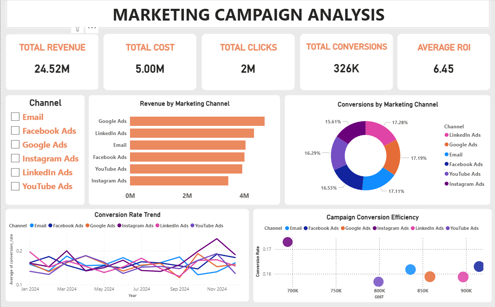

---

## Campaign Efficiency Visualization

This scatter plot compares campaign cost and conversion rate to identify the most efficient campaigns.

---

## Key Insights

- Marketing revenue is distributed across several channels.
- Conversion rates fluctuate over time.
- Some campaigns achieve higher efficiency with lower cost.
- High ROI campaigns highlight opportunities for scaling marketing strategies.

---

## Author

This project was created as part of a data analytics portfolio to demonstrate skills in:

- Data cleaning with Python
- Data analysis
- Marketing analytics
- Dashboard development using Power BI
